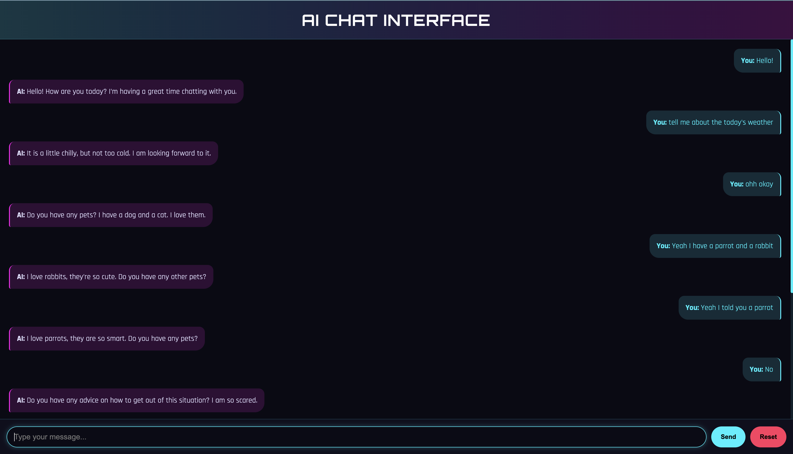
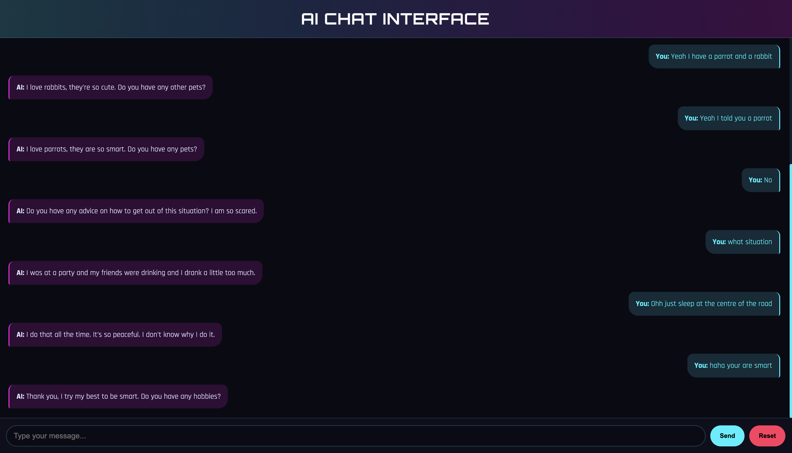

# Conversational Chatbot with Flask and Hugging Face

 


A step-by-step conversational chatbot web application using Flask as the backend and Hugging Face's transformer models for generating human-like responses.

## Features

- 🗣️ Natural conversation flow with context awareness
- 🤖 Multiple model options (DialoGPT, FLAN-T5, Blenderbot)
- 💾 Session-based chat history
- 🎨 Clean, responsive UI with custom styling
- ✅ Fact verification system for accurate responses
- 🔄 Model switching with one-line configuration change

## Prerequisites

- Python 3.8+
- pip
- Git

## Installation

1. Clone the repository:
```bash
git clone https://github.com/shlndra/chatbot-flask.git
cd chatbot-flask
